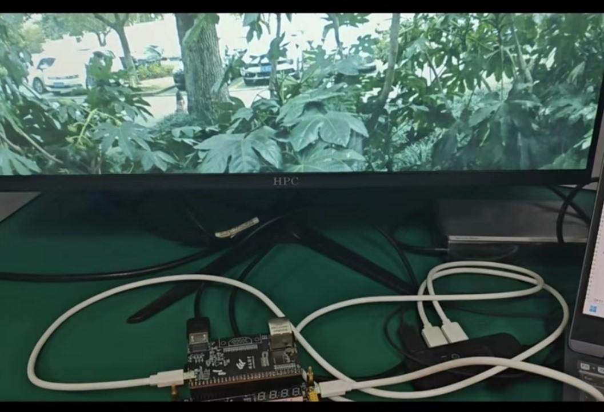
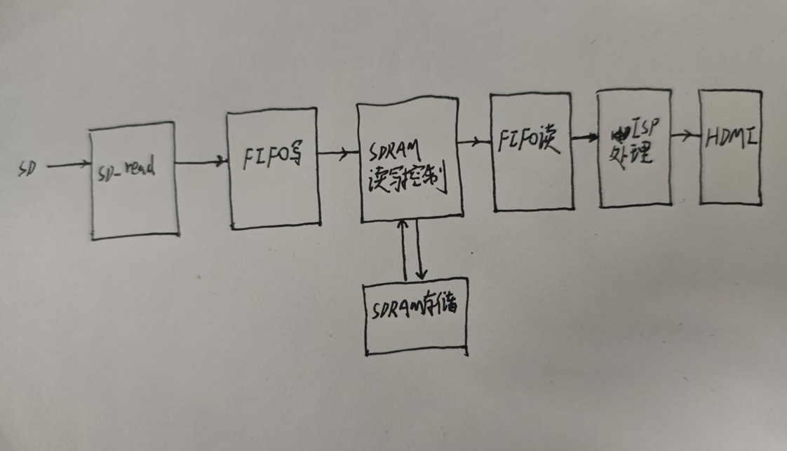

# anlu-EG-ISP
基于安路开发板的bayer视频简单处理

## 准备工作
pycharm2020，TD，安路开发板EG4S20BG256， 
处理的二进制高清视频太大，这里放一个百度网盘链接：https://pan.baidu.com/s/1oOa7B4wfUinSO2khUvy8-Q?pwd=matr 提取码：matr

## start

一个基础的图像处理部分，将Bayer类型的数据从SD卡中读出来，然后存入SDRAM，将SDRAM中读出来的数据进行Bayer2RGB以及白平衡处理，然后将对应的结果显示在HDMI上，显示的分辨率和刷新率是1920x1080p 30hz；花了三周的时间，每天晚上做一点，做了个最基础的框架，同时把相关代码放在这个下面，感兴趣的可以自己去试试，下面是效果图片。这只是一个非常简单的对应的框架，没有进一步去完善对应的功能，**还有很高的修改空间**，所以在这里源附带给出python的仿真代码。
可以谈谈提高修改的思路： 
- 帧率会很低，首先50M时钟SPI读取高清视频过慢，可以考虑一下SDIO协议（四线）读取SD卡，同时适当的超频。
- HDMI的显示分辨率有30hz，这个读取速度正常情况下SD卡读是跟不上的，那么SDRAM里面肯定要做乒乓操作，那么1920x1080，16bit的视频，在2Mx32bit（该开发板的SDRAM不支持数据掩码）的内存里不太好做乒乓：
  - 通过python仿真发现，16bit压缩到8bit（0-255）的范围内，效果可以接受，这样省出了一倍的空间；如果支持数据掩码的话，可以第一帧图像在2M空间的低8位，第二帧存在高8位，实现乒乓，但是该开发板不支持，所以不行。
  - 那么将一帧图像的每两个像素点存在一个16bit的位置里面，这样的话读也会读出来两个像素点，那么在后续的ISP处理模块，比如bayer2rgb就需要有两个并行的，一次完成两个像素点的转换，然后存入RAM中（这个时候不能用FIFO了），然后每个地址读两次，吞吐率一样；也能实现乒乓。
  - 对图像进行下采样，把图像分屏显示，也可以做乒乓。
- 如果资源足够，建议采用帧间压缩和帧内压缩，针对这个视频大部分没有变化的场景，这样能直接放在SDRAM里面。
- ISP部分再加一些算法就更好了，比如YCrCb域的转换等等。

 
图一：最原始的视频结果 
 
图二 python软件仿真处理后效果 
 
图三 FPGA处理效果 

使用的开发板是安路EGS420系列开发板，上面有EM638325系列的SDRAM，具体的操作方法可以去查对应SDRAM的芯片数据手册，开发工具使用安路的开发工具，名字叫做TD，下面是整个的一个基本框图。

 
图四 框架草图 

### 数据读取部分

这个SD卡的读取程序用的是野火通信的例程，具体的程序大家可以去网上搜索相关的代码。比较简单，就是一个简单的SPI程序，按照SD卡要求的时序完成对应代码的编写。分别是不同的命令初始化程序，对应写入的相关命令，主要是进行SD卡的一个读功能。

### SDRAM的一个控制程序
这里进行一个简单的说明，下图是SDRAM的一个主要的管脚
 

 
图五 SDRAM基本引脚 

稍微解释一下几个信号：
CKE信号：屏蔽系统时钟信号，冻结当前所有操作
CS信号：屏蔽和使能所有输入输出端口，CLK、CKE、DQM除外，低电平有效
CAS信号：列选通信号：低电平有效，为低电平时，A[8:0]输入的为列地址。
RAS信号：行选题信号：低电平有效，为低电平时，A[12:0]输入的为行地址。
WE信号：写使能信号，低电平有效，为低电平时，使能写操作和预充电。{CS、CAS、RAS、WE}构成SDRAM操作命令。
DQM信号：数据掩码。
BA信号：选择不同的BANK进行相关的操作。
A信号：地址总线，同时有其他不同的作用。
DQ信号：信号数据线，输入与输出同时公用。
SDRAM内部包含一个逻辑控制单元，内部包含模式寄存器和命令解码器。外部通过CS_N、RAS_N、CAS_N、WE_N以及地址总线向逻辑控制单元输入命令，命令经过命令解码器进行译码后，将控制参数保存到模式寄存器中，逻辑控制单元进而控制逻辑运行。
输入地址,行列信号控制器和Bank地址控制器共同控制对应的存储单元。
大小计算：
“4Meg×16×4Banks”表示SDRAM存储容量的具体参数，其中“4Meg”表示单个L-Bank包含的存储单元的个数，假设行地址总线为A0-A12，行地址数为8192行，列地址位宽为9位，列地址数为512列，单个LBank中包含的存储单元个数为行地址数(8192)与列地址数(512)相乘，乘积为4M(8192×512=4194306)；“16”表示每个存储单元存储数据的bit数；4Meg与16相乘表示单个L-Bank中可存储的Bit数；“4BANKS”表示一片SDRAM中包含的L-Bank个数，此SDRAM芯片包含4个L-Bank；由此可得SDRAM芯片的存储容量为：256MBit(4Meg×16×4BANKS)。
注意以下几个时间参数：
tRCD表示写入自激活命令到开始进行数据读写，中间所需的等待时间，列举的数值表示等待时间的最小值；tRP表示自预充电指令写入到预充电完成所需的等待时间，列举的数值表示等待时间的最小值；CL表示列选通潜伏期，表示自数据读指令写入到第一个有效数据输出所需等待时间。
配置寄存器命令和对应的地址选通线相关，可以查对应的芯片数据手册；
预充电相当于关闭指定对应的LBANK中刚刚激活过的行，包括刚刚进行写操作的对应的行，预充电的过程必须要等待对应的时钟周期Trp，对应的行才可以进行重新操作；
SDRAM一般每过64ms需要对数据进行刷新，等待trc；自动刷新一行行刷，自刷新用于休眠时候和低功耗的数据进行选择；自刷新前一定要进行预充电；
激活命令，激活特定的地方才能够对该地区的数据进行基本的读写操作；
要执行突发终止操作的话需要关闭自动预充电命令；
写入模式寄存器配置指令之后需要等待Tmrd时间；
(1)对SDRAM上电，加载稳定时钟信号，CKE设置为高电平；
(2)等待T=100us的时间，此过程中操作命令保持为空操作命令；
(3)100us等待结束后，写入预充电命令；
(4)预充电指令写入后，等待tRP时间，此过程中操作命令保持为空操作命令；(5)tRP等待时间结束后，写入自动刷新命令；
(6)自动刷新命令写入后，等待tRC时间，此过程中操作命令保持为空操作命令；
(7)tRC等待时间结束后，再次写入自动刷新命令；
(8)自动刷新命令写入后，等待tRC时间，此过程中操作命令保持为空操作命令；
(9)tRC等待时间结束后，写入模式寄存器配置指令。
这里刷新8次；

从时序图来看，自动刷新模块流程如下：
 
SDRAM在125M时钟下，这个时候4096行，刷新时间15.625us，计算计数；
(1)写入预充电命令，A10设置为高电平，对所有L-Bank进行预充电；
(2)预充电指令写入后，等待tRP时间，此过程中操作命令保持为空操作命令；
(3)tRP等待时间结束后，写入自动刷新命令；
(4)自动刷新命令写入后，等待tRC时间，此过程中操作命令保持为空操作命令；
(5)tRC等待时间结束后，再次写入自动刷新命令；
(6)自动刷新命令写入后，等待tRC时间，此过程中操作命令保持为空操作命令；(7)tRC等待时间结束后，自动刷新操作完成。
在到了时间时候需要向仲裁器申请刷新请求，这个时候仲裁器会给一个刷新en信号，完成自刷新之后需要给出一个结束标志位。这样算完成一次自刷新操作。

在完成了SDRAM的初始化操作已经自刷新模块设计之后，根据时序图做一个读写模块，，为了提高传输效率，本次设计采用突发读写的操作形式。这里的读写不是自动预充电的形式，只有这样，这样可以使用突发传输终止指令（但实际上并未用到该指令），具体的时序大体相同，以写操作为例子：
(1)发送激活指令到SDRAM，同时BA0-BA1、A0-A12分别写入L-Bank地址、行地址，激活特定L-Bank的特定行；
(2)激活指令写入后，等待tRCD时间，此过程中操作命令保持为空操作命令；
(3)tRCD等待时间结束后，写入写数据指令，同时A0-A8写入待数据的列首地址；
(4)读数据指令写入同时，由DQ开始写入数据，在最后一个数据写入后的下一个时钟写入突发终止指令；
(5)突发终止指令写入后，SDRAM的页突发写操作完成。

写数据的ack信号和fifo模块读使能信号相关，同时ack信号可以控制写操作的地址进行更新；激活之后进行写，写完之后预充电；激活一行之后该行持续有效，一次只能激活一个BANK钟的一行，要求对其他行进行操作首先要将之前激活的行进行预充电操作。先激活对应的行之后，往对应突发长度的列里面写数据，256列，写下一行要激活。

关于仲裁电路：
在FPGA的电路设计中有很多仲裁方法，但是这里选用优先级仲裁方法；自刷新请求优先级>写请求优先级>读请求优先级。同时优先级之间不会相互打断，只有在arbiter阶段才会对请求进行仲裁。同时保证写数据不会掉，所以写的权限相对而言更高一些。同时其他的SDRAM接口，比如CAS,RAS,WEN.BA等信号接口都需要经过仲裁电路进行判别，然后与SDRAM的接口相接。注意安路的SDRAM貌似看说明书数据掩码的功能是无法使用的，实际操作貌似也确实不行，这样确实不太利于乒乓操作。

关于FIFO之间的数据流：
在本工程中采用数据流的处理，当写入FIFO的数据量超过一定数值时，将SDRAM的写入请求信号拉高，这个拉高会给仲裁模块，仲裁模块会判定写开始，这样开始一个突发的写操作；这个时候开始进行SDRAM的激活等操作；对于读FIFO也是一样，当读取FIFO中的数据量小于一定数值时候，就会启动SDRAM的读程序，将数据填充进FIFO中间。

关于图像处理部分解析：
图片裁剪部分
从SD卡读入的数据流为串行的写入模式，再写入FIFO，对写FIFO的使能信号进行控制，裁剪每一帧图片的左上角的1920x1080部分，这样能够与显示器适配且不会发生错位。同时打算将多余的部分留下来用于处理图像的边界，在进入SDRAM前对边界进行卷积处理，存储进一个FIFO钟，和SDRAM出去后进行过去马赛克算法的图像进行拼接，形成一个完整的进行过边界卷积处理的图像。
像素色域的压缩
考虑到SDRAM需要为了能够在SDRAM中实现乒乓的操作，而原始视频每一帧的大小为1936*1088*16bit大小(每16bit的后四位结果是0，影响微乎其微)，无法存储两帧的数据，通过python的仿真对比发现， 0-65525和0-255的色域亮度区别在肉眼观察上不会有太大的影响，所以我们将进入SDRAM的数据每一个像素点的亮度从2^16-1进行修改，将亮度区间改正到0-255之间，这样使得SDRAM能够存储3张图片。
白平衡算法模块
常见的白平衡算法有灰度世界法和完美世界法，两种算法之间并没有明显的优劣之分，根据颜色分布的均匀与否可以选择合适的算法，我们这里采用灰度世界法。灰度世界算法以灰度世界假设为基础，该假设认为：对于一幅有着大量色彩变化的图像,其R,G,B三个色彩分量的平均值趋于同一灰度值K。从物理意义上讲，灰色世界法假设自然界景物对于光线的平均反射的均值在总体上是个定值，这个定值近似地为“灰色”。颜色平衡算法将这一假设强制应用于待处理图像，可以从图像中消除环境光的影响，获得原始场景图像。
灰度世界算法计算速度快，适用于大多数场景，且资源消耗少，加上安路开发板搭载的DSP模块，能很快对浮点数进行计算，同时对浮点数进一步处理即可得到经过白平衡后的结果。通过软件的仿真，能够得到对应通道的增益，蓝色Bayer像素点为1.75，红色Bayer通道像素点为1.875，分别对应的16进制数为8’h1C和8’h1e，在RAW域对视频进一步处理，保证在去马赛克算法后能恢复正确的色调。
Bayer2RGB模块
对于Bayer2RGB的算法，有很多种，可以根据最近领域的GBRG来恢复出对应的通道的RGB的通道值，但是从python的角度来看，效果一般，图像视频的糊状比较明显，出此类插值外还有双线性插值法以及基于梯度的插值法，这些插值算法对本次视频处理的图像效果更好，同时对于摩尔纹和拉链效应也有着不错的效果，通过对比python所给出的仿真结果，我们采用双线性插值法，在FPGA中模拟一个3x3的卷积核滑动效果，对SDRAM突发读出来的数据进行处理。
对于GBRG类型的bayer数据图像，双线性插值法的原理如下，在本程序中，在对应的色域通道不进行相应的处理，用相邻的九宫格对附近的色域数值进行对应的双线性插值计算。
在fpga上实现的话需要模拟出相应的3x3滑动模块，对应的区域内的像素点进行处理，那么首先考虑的移位寄存器进行菊花链的电路模拟，来保证源源不断输入数据的同时，输出的数据对应的3x3通道的数据值，但是该开发板上没有移位寄存器的IP核，而且自己手写移位寄存器的话将会消耗大量的资源，那么我们采用FIFO的资源进行综合，采用板上的ram资源来存储对应的两行数据，同时放弃菊花链的存储结构，给两个fifo单独的写入计数器，第一个FIFO写入的数据值是从第1-1919行的数据，读出的信号是当FIFO已经写入一行数据之后开始度有效，当存进FIFO的数据量达到两行的时候，开始将第二个fifo的数据读出，这个时候第二个fifo读出的数据就是第一行矩阵，第一个fifo就是第二个矩阵，依次情况不断类推，同时要注意的是，第二个fifo的深度相对第一个要大，因为需要存储两行数据，同时第二个FIFO只需要存储从第1-1918行的数据即可。同时将将两个FIFO读出来的数据
存入对应的九宫格矩阵，这样表示需要接受运算的3*3滑块。通过对计数器的末尾来判断奇偶数，选取对应的插值计算公式。本程序中为了减少除法的滥用，将除法采用对应的移位来实现，减少资源消耗同时方便时序收敛。

